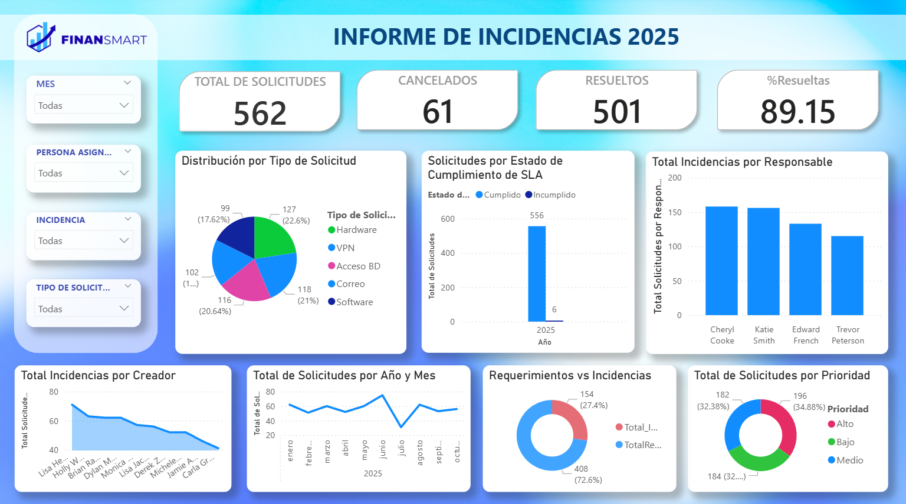
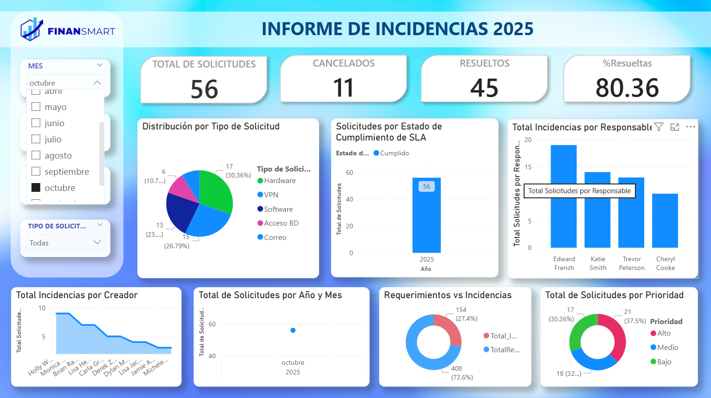
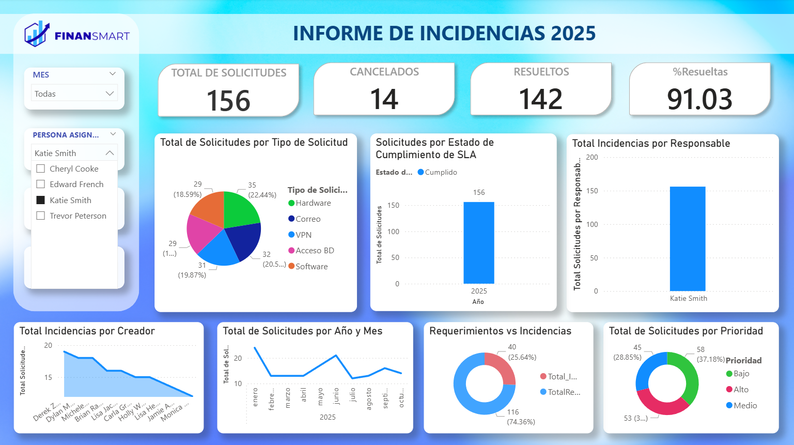
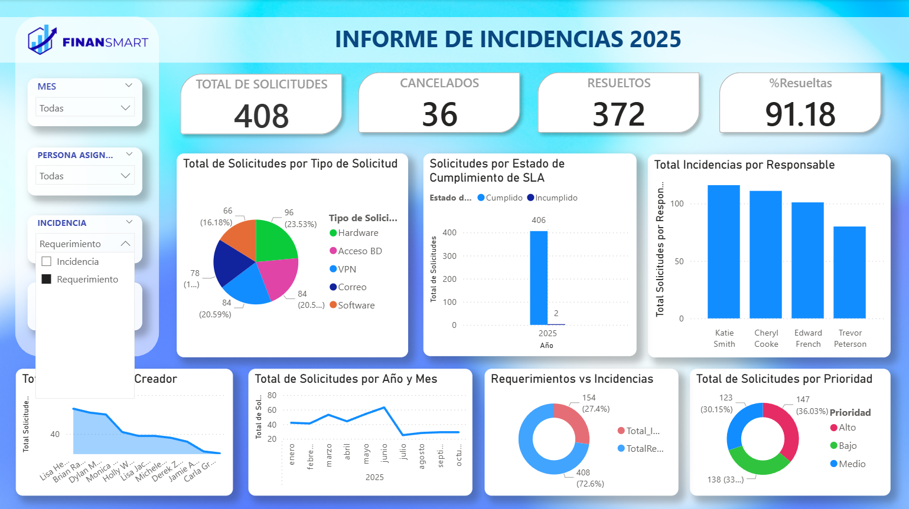
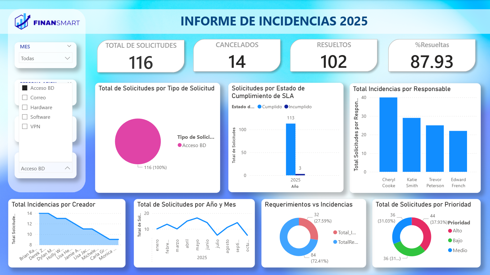

# Gestion-de-Incidencias_2025
Dashboard interactivo en Power BI para gestión de incidencias | Power Query, DAX, ETL | Caso demostrativo

# Jira Incident Report - FinanSmart (2025)
This incident report covers data from 2025 through October, collected from Jira for the fictional fintech company **FinanSmart**. The report aims to provide a clear and detailed view of the reported incidents, indentifying problem areas, and make informed decisions to improve service and keep users satisfied.

## Objective
Automate technical incident reporting to:
- Visualize request volume and status
- Monitor SLA compliance
- Analyze support team performance
- Identify recurring problem areas

## Key Metrics
- **562** total requests
- **89.15%** of tickets resolved
- **SLA compliance** tracking
- Distribution by **request type** (Hardware, Software, VPN, etc.)
- Workload analysis by **assignee**
- Historical trend by **month and year**

## Data Processing Pipeline

### 1. Data Collection
- Export data from ticket system (CSV format)
- Organize by status, problem type, and responsible person

### 2. Data Cleaning & Transformation
- **Grammar correction** in textual data
- **Remove redundant words** to improve analysis quality
- **Eliminate incomplete records** to ensure accuracy
- **Data type conversion** (dates, numbers, text)
- **Create calculated columns** to facilitate analysis

### 3. Visualization Creation
- **Import to Power BI** from CSV files
- **Transform fields** to appropriate formats
- **Interactive dashboard** with bar charts, line graphs, and KPI cards
- **Area analysis** to identify zones with the most problems

### 4. Filters & Metrics
- **Interactive filters** by month, responsible person, and problem type
- **Custom KPI measures** for calculating total incidents by status
- **Average resolution time** and other key metrics

## Dashboard Views

### Overall Dashboard

*Complete dashboard view with all main metrics and visualizations*

### Monthly Analysis (October 2025)

*Filtered by October 2024: monthly request distribution and temporal trends*

### Performance by Assignee

*Workload analysis by team member and resolution efficiency*

### Diagnosis by Incident Type

*Segmentation by specific incident type to identify recurring problems*

### Distribution by Request Type

*Categorized analysis by request type (Hardware, Software, VPN, DB Access, etc.)*

## Business Impact
- **Improved incident response**: Analysis helps team respond faster to recurring problems
- **Critical area prioritization**: Identification of zones with highest incident volume
- **Data-driven decisions**: Implementation of improvements in high-volume areas

## Technology Stack
- **Power BI** for visualization and dashboards
- **Power Query** for data transformation and cleaning (ETL)
- **DAX** for creating custom metrics
- **Excel/CSV** as data source

## How to Use the Dashboard

### Filter Options:
1. **Filter by month** for temporal trend analysis
2. **Select assigned person** for individual performance evaluation
3. **Filter by incident type** for specific diagnosis
4. **Analyze by request type** for resource optimization

### Key Features:
- Real-time KPI monitoring
- Interactive data exploration
- Historical trend analysis
- Team performance tracking
- SLA compliance monitoring
